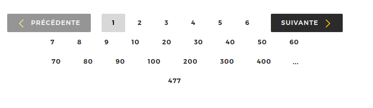
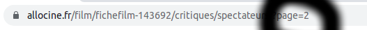
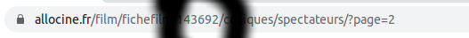
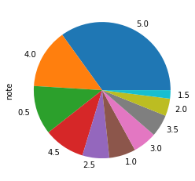
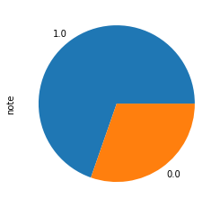
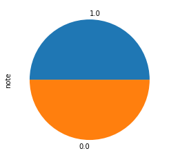
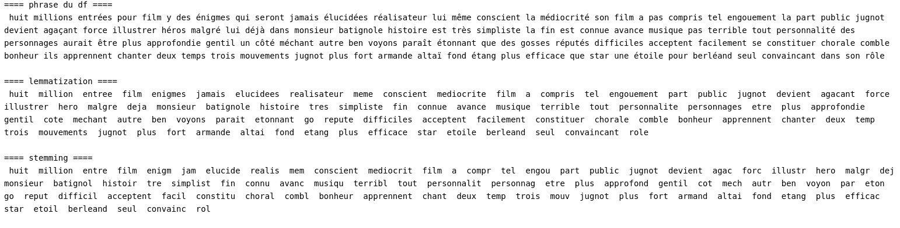
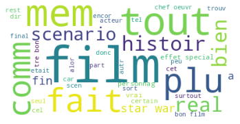
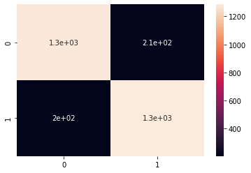

# 
**Traitement du language naturel**

## Architecture  

- <i>data.csv</i> : les données préparées sauvegardées  
- <i>dossier joblib : </i> les transformateurs et les estimateurs entrainés utilisés dans les notebooks
- <i>dossier json : </i> les mots utilisés pour l'apprentissage et utilisés pour les mises en dataframes
- <i>requirements.txt :</i> les bibliothèques python à installer
- <i>dossier data :</i> un fichier csv correspond à un film.

- <i>train.ipynb : </i>
    - web scraping
    - analyse des données
    - nettoyage des données
    - découvertes des traitements de texte (stemming, lemmatization)
    - choix des mots à conserver  
    - transformeur : CountVectorizer
    - entraînement de l'estimateur
    - prédictions
 

- <i>train_idf.ipynb :</i>
    - transformeur : tf-idf
    - entraînement de l'estimateur
    - prédictions

- <i>essai_lemm.ipynb :</i>
    - lemmatization
    - transformeur : CountVectorizer
    - entraînement du classifieur
    - prédictions

- <i>app.ipynb :</i>
    - import du modèle issu de <i>train.ipynb</i>
    - application

- <i>app.ipynb :</i>
    - import du modèle issu de <i>train_idf.ipynb</i>
    - application

## **Introduction**

### Contexte du projet 

En règle générale, le nombre d'avis sur un film peut être important et par conséquent le temps de lecture de chaque commentaire peut être une tâche lourde.  

Alors comment déterminer de manère rapide si un film a eu du succès auprès des spectateurs ou pas ?     

Dans ce contexte, l'idée du projet est d'utiliser des algorithmes d'apprentissage automatique pour la tâche d'analyse de sentiment des spectateurs via leur critique.  

Tout d’abord, il sera question de récupérer les données directement du site d'Allociné. Nous allons récupérer les commentaires avec leur note associciée afin d'effectuer une classification.

### Sommaire :

1. Extraction des données  
2. Préparation des données  
3. Entraînement d'un modèle de classification
4. Application en temps réel

## 1. Extraction des données  

Le site Allociné est suffisamment structuré pour pouvoir identifier des balises html récurrentes sur plusieurs pages.  

Nous identifions plusieurs pages de commentaires par film, chaque page correspondant à une incrémentation de l'url par méthode GET. Il est possible de récupérer le nombre de pages total de façon automatique.

   

  

L'entraînement d'un modèle nécessite beaucoup de données, nous décidons donc de récupérer les données de 1000 films selon une incrémentation de l'url de la manière suivante : 

Les données extraites sont mises en minuscule, la ponctuation est supprimée par expression régulière, y compris les symboles pouvant induire une compréhension globale (point d'interrogation, d'exclamation), et enregistrées dans des fichiers CSV.    

Les données sont chargées dans un Dataframe, nous disposons de 49000 commentaires environ.  

## 2. **Préparation des données**  

### **création du dataframe**   

Il est demandé d'effectuer une classification binaire. Voici la classification initiale : 

Les notes au-dessus de 2.5 sont classées 1, les autres 0. Voici la répartition une fois la transformation effectuée : 

Nous constatons que la répartition n'est pas homogène, l'apprentissage sera biaisé. Un dataframe est créé avec le même nombre de commentaires positifs et de commentaires négatifs : 

### **réduction de dimensions**  

Une fonction est créée pour effectuer une réduction de dimensions. L'étape première est la suppression des stop-words.  

> En recherche d'information, un mot vide (ou stop word, en anglais) est un mot qui est tellement commun qu'il est inutile de l'indexer ou de l'utiliser dans une recherche. En français, des mots vides évidents pourraient être « le », « la », « de », « du », « ce »...  

Nous effectuons ensuite un traitement soit de stemming, soit de lemmatisation.   

> Stemming : un même mot peut se retrouver sous différentes formes en fonction du genre (masculin féminin), du nombre (singulier, pluriel), la personne (moi, toi, eux…) etc. Le stemming désigne généralement le processus heuristique brut qui consiste à découper la fin des mots dans afin de ne conserver que la racine du mot.

> La lemmatisation désigne un traitement lexical apporté à un texte en vue de son classement dans un index1 ou de son analyse. Ce traitement consiste à appliquer aux occurrences des lexèmes sujets à flexion (en français, verbes, substantifs, adjectifs) un codage renvoyant à leur entrée lexicale commune (« forme canonique » enregistrée dans les dictionnaires de la langue, le plus couramment), que l'on désigne sous le terme de lemme.  

Stemming et Lemmatisation sont essayés, sans que cela change les scores et matrices de confusions, nous ne traiterons donc que du stemming dans la suite du document.

> l'essai avec lemmatisation est dans le fichier essai_lemm.ipynb   

Voici une exemple de lemmatisation et de stemming sur un même commentaire : 

### **sac de mots**  

Le dataframe est séparé en 70% de données d'entraînement, 20% de données de test, 10% de données de validation.

Nous affichons un sac de 40 mots par Matplotlib, sur le dataframe d'entraînement.

  

Certains termes importants ne semblent pas très pertinents, par exemple 'film', néanmoins nous les gardons pour cet essai par manque de temps pour le nettoyage poussé des données. Pour le jeu d'apprentissage, nous choisissons de garder 500 mots, et d'appliquer cette transformation sur les jeux de test et de validation.  

## **3. Entraînement d'un modèle de classification**  

Les données sont transformées en données numériques et en matrices par le transformeur CountVectorizer de la bibliothèque Scikit-learn dans le notebook initial et avec le transformeur tf-idf dans un second notebook (train_idf.ipynb).

Le classifieur choisi est la régression logistique, le nombre d'itérations est choisi par GridSearchCv. Les scores sont homogènes, il n'y a donc pas d'overfitting : 

CountVectorizer : 
- 82 % sur les données d'entraînement,
- 82 % sur les données de test,
- 82 % sur les données de validation.  

Tf-idf : 
- 83 % sur les données d'entraînement,
- 83 % sur les données de test,
- 83 % sur les données de validation.  

CountVectorizer, lemmatization :
- 83 % sur les données d'entraînement,
- 82 % sur les données de test,
- 82 % sur les données de validation.  

La matrice de confusion sur les données de validation pour le premier essai : 

  

Le dictionnaire de mots est exporté dans un fichier json, le modèle de pré-traitement countVectorizer et le classifieur de régression logistique sont exportés par joblib. 

## **4. Application**  

Il n'est pas demandé d'avoir une application graphique ; nous créons donc une application dans le notebook <i>app.ipynb</i> issu du premier essai, une deuxième application dans le notebook <i>app_idf.ipynb</i> pour le deuxième essai. 
Une connaissance rudimentaire est nécessaire pour le fonctionnement des applications (exécuter une cellule de notebook, créer une variable de chaîne de caractère).

Le traitement des données ci-dessus démontre (sur 1000 films) qu'il y a beaucoup plus de critiques positives que négatives de façon générale. Nous ne pouvons donc pas déterminer si un film a eu du succès ou non selon les critiques des téléspectateurs. Nous décidons donc d'effectuer une classification selon un seul commentaire.

Pour obtenir la prédiction il suffit de passer un texte (variable python de type string) dans la fonction prediction().

